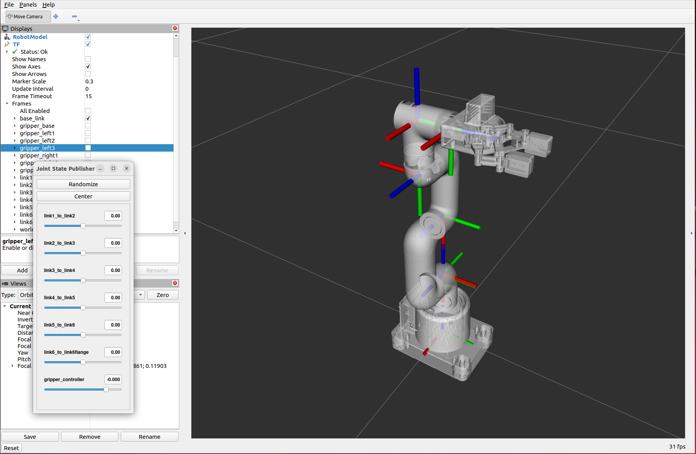

# mycobot_ros2 #

## Overview

This repository contains ROS 2 packages for simulating and controlling the myCobot robotic arm. It provides support for Gazebo simulation and visualization in RViz.

## Getting Started

For a complete step-by-step walkthrough on how to build this repository from scratch, start with this tutorial:
[How to Model a Robotic Arm with a URDF File (ROS 2)](https://automaticaddison.com/how-to-model-a-robotic-arm-with-a-urdf-file-ros-2/)

This guide will take you through the entire process of setting up and understanding the mycobot_ros2 project.

## Features

- Gazebo simulation of the myCobot robotic arm
- RViz visualization for robot state and motion planning
- MoveIt 2 integration for motion planning and control
- Pick and place task implementation using the MoveIt Task Constructor (MTC)

